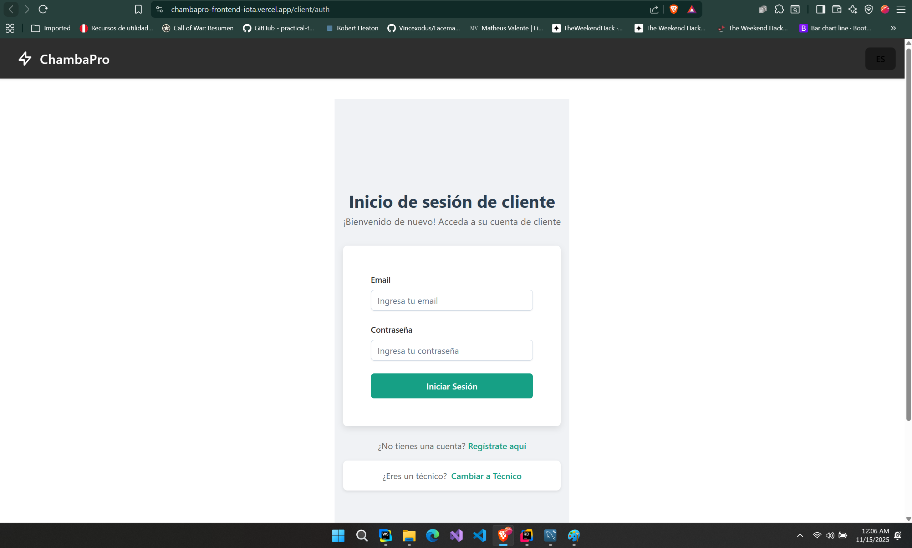
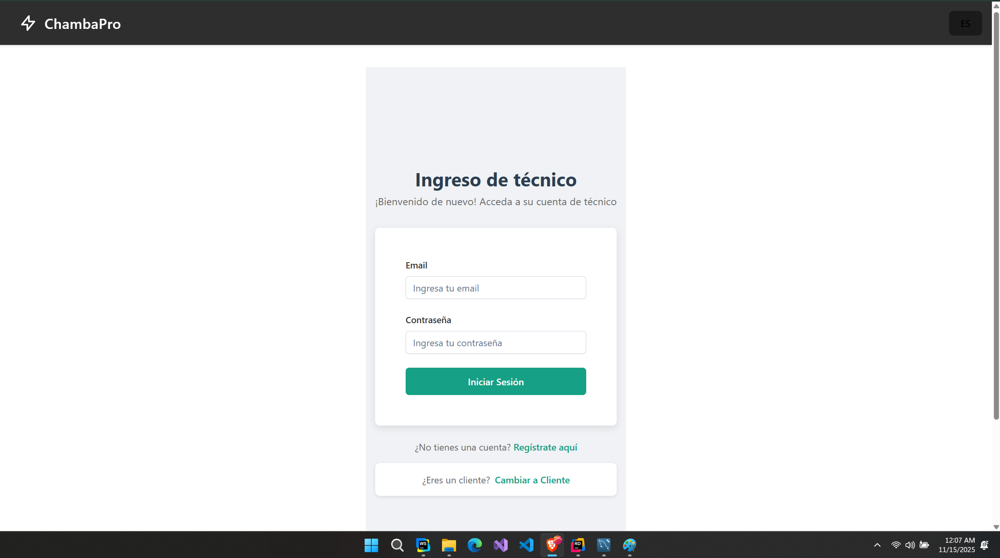
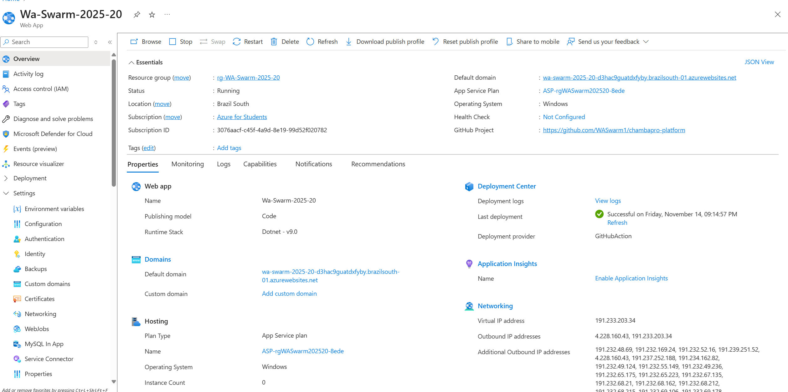
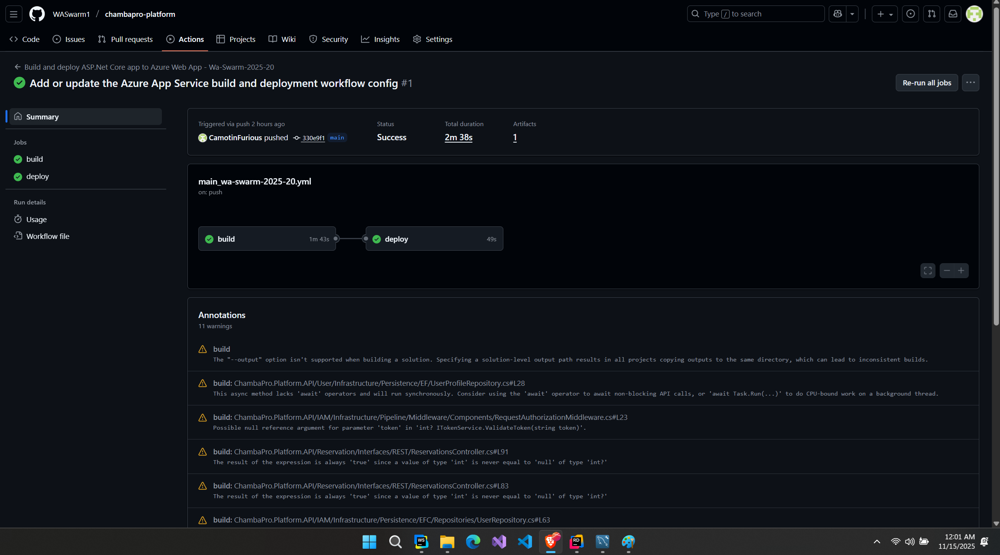

# Capítulo V: Product Implementation, Validation & Deployment

## 5.1. Software Configuration Management

En esta sección se describen las herramientas y configuraciones utilizadas para gestionar el desarrollo del software, 
incluyendo el entorno de desarrollo, el control de versiones, las convenciones de estilo de código y la configuración del despliegue.

### 5.1.1. Software Development Environment Configuration

En esta sección, se incluirá los productos de software que se usaron en el proyecto. Los enlaces a cada una de las 
herramientas se encuentran disponibles en los anexos.

#### Project Management:

* Trello: Herramienta de gestión de proyectos basada en tableros Kanban. Permite organizar tareas, asignar 
responsabilidades y hacer seguimiento del progreso del proyecto.

#### Product UX/UI Design:

* Figma: Herramienta de diseño colaborativo para crear prototipos, wireframes y diseños de interfaces de usuario.
* Uxpressia: Plataforma para crear mapas de experiencia de usuario, customer journey maps y user personas.
* Visual Paradigm: Herramienta de modelado UML y diseño de software.

#### Software Development:

* Rider: Entorno de desarrollo integrado (IDE) para .NET y C#.
* Webstorm: IDE para desarrollo web, soporta HTML, CSS, JavaScript y frameworks modernos.
* GitHub: Plataforma de alojamiento de código fuente y control de versiones utilizando Git.
* Visual Studio Code: Editor utilizado únicamente para la exportación del reporte de formato markdown a PDF.

#### Software Deployment:

* GitHub Pages: Servicio de alojamiento web estático proporcionado por GitHub, ideal para desplegar sitios web y documentación.
* Netlify: Plataforma de despliegue y alojamiento para sitios web estáticos y aplicaciones web modernas.

### 5.1.2. Source Code Management

Para la gestion del código fuente se utilizó GitHub, una plataforma de alojamiento de código fuente y control de versiones utilizando Git.
Se creó un repositorio en la organización de GitHub, donde se almacenó todo el código fuente del proyecto. 
El repositorio se estructuró de la siguiente manera:

* Organización en Github: [https://github.com/WASwarm1](https://github.com/WASwarm1)
* Repositorio de el informe: [https://github.com/WASwarm1/chambapro-report](https://github.com/WASwarm1/chambapro-report)  
* Repositorio de la Landing Page: [https://github.com/WASwarm1/chambapro-landing-page](https://github.com/WASwarm1/chambapro-landing-page)

#### Modelo de ramificación: GitFlow

Se utilizó el modelo de ramificación GitFlow, el cual permite una gestión eficiente del desarrollo mediante ramas específicas para diferentes propósitos.

Para el repositorio del informe final, se utilizó la siguiente estructura de ramas:

* `main`: Rama principal que contiene la versión estable del informe.
* `develop`: Rama de desarrollo donde se integran todas las características antes de ser fusionadas a `main`.
* `chapter1`: Rama para el desarrollo del Capítulo I.
* `chapter2`: Rama para el desarrollo del Capítulo II.
* `chapter3`: Rama para el desarrollo del Capítulo III.
* `chapter4`: Rama para el desarrollo del Capítulo IV.
* `chapter5`: Rama para el desarrollo del Capítulo V.

Para el repositorio de la Landing Page, se utilizó la siguiente estructura de ramas:

* `main`: Rama principal que contiene la versión estable de la landing page.

#### Estilo de commits: Conventional Commits

Se adoptó la convención de commits "Conventional Commits" para mantener un historial de cambios claro y consistente.
Los tipos de commits utilizados incluyen:

* `feat`: Para nuevas características o funcionalidades.
* `fix`: Para correcciones de errores.
* `docs`: Para cambios en la documentación.
* `refactor`: Para cambios en el código que no agregan ni corrigen funcionalidades.

El prefijo de categoría se define de la siguiente forma:

* `feat`: A new feature
* `fix`: A bug fix
* `docs`: Documentation only changes
* `style`: Changes that do not affect the meaning of the code (white-space, formatting, missing semi-colons, etc)
* `refactor`: A code change that neither fixes a bug nor adds a feature
* `test`: Adding missing tests or correcting existing tests
* `chore`: Changes to the build process or auxiliary tools and libraries such as documentation generation

### 5.1.3. Source Code Style Guide & Conventions

Se adoptaron las siguientes guías y convenciones de estilo de código para asegurar la calidad y consistencia del código fuente, el idioma
estándar para el desarrollo fue el **inglés**.

#### Principios generales:

* **Idioma estándar**: Inglés
* **Legibilidad ante todo**: El código debe ser fácil de leer y entender.
* **Consistencia**: Seguir las mismas convenciones en todo el proyecto.
* **Nombres semánticos**: Utilizar nombres descriptivos para variables, funciones y clases. 
Se usan **sustantivos** para clases y **verbos** para funciones.
* **Indentación**: Usar 2 espacios para la indentación de HTML, CSS, JS y TS. 4 espacios para C#.

#### HTML y CSS:

#### HTML:

* Archivos HTML deben tener la extensión `.html`.
* Se incluye `alt` en todas las imágenes.
* Usar comillas dobles para atributos.
* Usar etiquetas semánticas (`<header>`, `<nav>`, `<main>`, `<footer>`, etc.).
* Indentación de 2 espacios.

#### CSS:

* Archivos CSS deben tener la extensión `.css`.
* Usar guiones para nombres de clases y IDs (e.g., `.main-header`).
* Se agrupan estilos relacionados y se separan con comentarios.

#### JavaScript y TypeScript:

* Archivos JS deben tener la extensión `.js` y TS `.ts`.
* Usar camelCase para nombres de variables y funciones.
* Usar `PascalCase` para nombres de clases y componentes: `MyComponent`, `UserProfile`.
* Usar `const` y `let` en lugar de `var`.
* Usar funciones flecha y nombres explícitos.
* Los archivos deben tener una unica responsabilidad (Single Responsibility Principle).

#### C#:

* Archivos C# deben tener la extensión `.cs`.
* Usar `PascalCase` para nombres de clases, métodos y propiedades.
* Usar `camelCase` para nombres de variables y parámetros.
* Indentación de 4 espacios.

### 5.1.4. Software Deployment Configuration

En esta sección se describen las configuraciones y herramientas utilizadas para el despliegue del software desarrollado.
El objetivo es asegurar que el proceso de despliegue sea eficiente, automatizado y confiable.

#### Despliegue de la Landing Page:

La **Landing Page** fue desarrollada utilizando tecnologías web estándar como HTML, CSS y JavaScript. Y fue desplegada utilizando **GitHub Pages**, 
un servicio de alojamiento web estático proporcionado por GitHub.

#### Pasos para el despliegue:

1. **Creación del repositorio**: Se creó un repositorio en la organización de GitHub llamado `Landing-Page`.
2. **Desarrollo del sitio**: El código fuente de la landing page se desarrolló y organizó en el repositorio.
3. **Configuración de GitHub Pages**: En la configuración del repositorio, se habilitó GitHub Pages seleccionando la rama `main` como fuente.
4. **Despliegue automático**: Cada vez que se realiza un push a la rama `main`, GitHub Pages actualiza automáticamente el sitio web.

**Repositorio de la Landing Page**: [https://github.com/WASwarm1/chambapro-landing-page](https://github.com/WASwarm1/chambapro-landing-page)  
**URL de la Landing Page desplegada**: [https://waswarm1.github.io/chambapro-landing-page/](https://waswarm1.github.io/chambapro-landing-page/)

## 5.2. Landing Page, Services & Applications Implementation

En esta sección se detalla la implementación de todos los estables de ChambaPro.

#### Landing Page:

La landing page fue desarrollada utilizando HTML, CSS y JavaScript; y fue diseñada para ser responsiva y adaptarse a diferentes dispositivos.
El diseño se basó en los wireframes y mock-ups creados durante la fase de diseño UX/UI y fue desplegada utilizando GitHub Pages.

La landing page incluye las siguientes secciones principales:
* Home: Sección principal con una descripción del producto y un llamado a la acción.

* About Us: Información sobre el equipo fundador, misión y visión.

* Our Team: Presentación de los miembros del equipo con sus roles y biografías.

* For Technicians: Beneficios y características para profesionales técnicos.

### 5.2.1. Sprint 1

#### 5.2.1.1. Sprint Planning 1

<table>
<tr>
    <th colspan="5">Sprint 1</th>
    <th colspan="9">Sprint 1</th>
  </tr>
      <tr>
    <td colspan="13">Sprint Planning Background</td>
  </tr>
  <tr>
    <td colspan="5">Date</td>
    <td colspan="8">2025-09-10</td>
</tr>
  <tr>
    <td colspan="5">Time</td>
    <td colspan="8">21:30</td>
  </tr>
  <tr>
    <td colspan="5">Location</td>
    <td colspan="8">via Google Meets</td>
<tr>
    <td colspan="5">Prepared By</td>
    <td colspan="8">Werner Lang</td>
</tr>
<tr>
    <td colspan="5">Attendees (to planning meeting)</td>
    <td colspan="8">Werner Khalil Lang Nassi, Jorge Francisco Taipe Sangama, Saúl Ortega Muñoz, Matias Gabriel Armestar Heredia, Emilia Duran Santander</td>
</tr>
<tr>
    <td colspan="5">Sprint  1 Review Summary</td>
    <td colspan="8">En este primer sprint se asignaron responsabilidades a cada integrante y planteo los requerimientos para el desarrollo de la Landing Page.</td>
</tr>
<tr>
    <td colspan="5">Sprint 1 Retrospective Summary</td>
    <td colspan="8">En esta sección todos los integrantes mencionaron tener aciertos en partes del codigo y en otras partes poder mejorar sus habilidades realizando la Landing Page</td>
</tr>
<tr>
    <td colspan="13">Sprint Goal & User Stories</td>
</tr>
<tr>
    <td colspan="5">Sprint 1 Goal</td>
    <td colspan="8">
Desarollar y desplegar una lading con la finalidad de presentar información relevante a los usuarios a través de imágenes.
La página debe ser completamente adaptable a todos los dispositivos que puedan utilizar los usuarios, asegurando una experiencia
fluida y responsiva.</td>
</tr>
</table>

#### 5.2.1.2. Aspect Leaders and Collaborators

| Team member (LastName, First Name) | GitHub UserName | Aspect 1: Landing Page Leader (L) / Collaborator (C) | Aspect 2: Diseños Figma: Leader (L) / Collaborator (C) | Aspect 3: Reporte (L) / Collaborator (C) |
|------------------------------------|-----------------|------------------------------------------------------|--------------------------------------------------------|------------------------------------------|
| Lang Nassi, Werner Khalil          | 00WernerLang    | L                                                    | C                                                      | L                                        |
| Jorge Franciscoz Taipe Sangama     | CamotinFurious  | C                                                    | L                                                      | L                                        |
| Ortega Muñoz, Saúl                 | Ss1lent10       | C                                                    | L                                                      | C                                        |
| Armestar Heredia, Matias Gabriel   | MatiasArmestar  | L                                                    | C                                                      | L                                        |
| Duran Santander, Emilia            | emiliadurans    | C                                                    | L                                                      | C                                        |

#### 5.2.1.3. Sprint Backlog 1

|  Sprint 1  |            Sprint 1             |     |                                      |                                                                      |                    |                  |                                                |
|:----------:|:-------------------------------:|:---:|:------------------------------------:|:--------------------------------------------------------------------:|:------------------:|:----------------:|:----------------------------------------------:|
| User Story |        Work-Item / Task         |     |                                      |                                                                      |                    |                  |                                                |
|     Id     |              Title              | Id  |                Title                 |                             Description                              | Estimation (Hours) |   Assigned To    | Status (To do / In process / To review / Done) |
|    US01    |  Ver descripción del producto   | W01 |      Diseñar wireframe de hero       | Crear wireframe de la sección principal con descripción del producto |         2          |   Werner Lang    |                      Done                      |
|            |                                 | W02 |  Redactar contenido descriptivo      |       Escribir textos claros sobre funcionalidad y beneficios        |         3          |   Werner Lang    |                      Done                      |
|            |                                 | W03 |       Desarrollar sección hero       |       Maquetar y codificar la sección principal de la landing        |         4          |   Werner Lang    |                      Done                      |
|    US02    |   Conocer al equipo fundador    | W04 |   Recopilar información del equipo   |      Obtener fotos, nombres, roles y biografías de cada miembro      |         1          |   Werner Lang    |                      Done                      |
|            |                                 | W05 |     Diseñar tarjetas de miembros     |        Crear diseño de las tarjetas para mostrar información         |         2          |   Werner Lang    |                      Done                      |
|            |                                 | W06 | Desarrollar sección "Sobre nosotros" |        Implementar página completa con información del equipo        |         3          |   Werner Lang    |                      Done                      |
|    US03    |      Ver misión y visión        | W07 |       Redactar misión y visión       |          Definir y escribir la misión y visión de ChambaPro          |         2          |   Werner Lang    |                      Done                      |
|            |                                 | W08 |     Diseñar layout misión/visión     |          Crear diseño visual para presentar misión y visión          |         1          |   Werner Lang    |                      Done                      |
|            |                                 | W09 |   Integrar misión/visión al sitio    |            Implementar sección dentro de "Sobre nosotros"            |         2          |   Werner Lang    |                      Done                      |
|    US04    |  Ver beneficios para clientes   | W10 |     Identificar beneficios clave     |       Listar y priorizar beneficios principales para clientes        |         1          |   Werner Lang    |                      Done                      |
|            |                                 | W11 |   Crear iconografía de beneficios    |          Diseñar íconos representativos para cada beneficio          |         2          |   Werner Lang    |                      Done                      |
|            |                                 | W12 |  Desarrollar sección de beneficios   |       Implementar sección visual con beneficios para clientes        |         3          |   Werner Lang    |                      Done                      |
|    US05    |  Ver beneficios para técnicos   | W13 |   Definir beneficios para técnicos   |       Especificar ventajas únicas para profesionales técnicos        |         1          |   Werner Lang    |                      Done                      |
|            |                                 | W14 |    Diseñar sección para técnicos     |       Crear layout específico para mostrar beneficios técnicos       |         2          |   Werner Lang    |                      Done                      |
|            |                                 | W15 |   Implementar beneficios técnicos    |       Desarrollar sección completa para profesionales técnicos       |         3          |   Werner Lang    |                      Done                      |
|    US06    |     Ver botón de registro       | W16 |     Diseñar botón call-to-action     |        Crear diseño atractivo del botón de registro principal        |         1          |   Werner Lang    |                      Done                      |
|            |                                 | W17 |  Configurar redirección de registro  |         Implementar navegación hacia formulario de registro          |         1          |   Werner Lang    |                      Done                      |
|            |                                 | W18 |      Integrar botón en cabecera      |          Posicionar y maquetar botón en hero de la landing           |         1          |   Werner Lang    |                      Done                      |
|    US07    |     Ver botón de contacto       | W19 |    Recopilar información contacto    |       Definir canales de contacto: email, teléfono, formulario       |         1          | Matais Armestar  |                      Done                      |
|            |                                 | W20 |      Diseñar footer de contacto      |      Crear diseño del pie de página con información de contacto      |         2          | Matais Armestar  |                      Done                      |
|            |                                 | W21 |   Desarrollar sección de contacto    |    Implementar footer completo con todos los enlaces adicionales     |         2          |   Werner Lang    |                      Done                      |

#### 5.2.1.4. Development Evidence for Sprint Review.

En esta sección se demuestran los commits relacionados con los principales avances en la implementación. 
Estos commits provienen del repositorio de la landing de la organización de GitHub.

**Enlace al repositorio de la Landing Page:** [https://github.com/WASwarm1/chambapro-landing-page](https://github.com/WASwarm1/chambapro-landing-page)

| Repository           | Branch | Commit Id | Commit Message                      | Commit Message Body | Commited on (Date) |
|----------------------|--------|-----------|-------------------------------------|---------------------|--------------------|
| WASwarm/Landing-Page | main   | c612997   | fix: Logo color                     |                     | 9/9/2025           |
| WASwarm/Landing-Page | main   | 996ddc5   | feat(landing): add technicians page |                     | 10/9/2025          |
| WASwarm/Landing-Page | main   | 0ba8c74   | feat(landing): add about us page    |                     | 10/9/2025          |
| WASwarm/Landing-Page | main   | 7a5a95e   | feat(landing): add our team page    |                     | 10/9/2025          |
| WASwarm/Landing-Page | main   | 52d97f6   | fix: add i18n for terms             |                     | 10/9/2025          |
| WASwarm/Landing-Page | main   | 44a5e9e   | feat(landing): add services html    |                     | 11/9/2025          |
| WASwarm/Landing-Page | main   | bf1eabf   | feat(landing): add contact html     |                     | 11/9/2025          |

#### 5.2.1.5. Execution Evidence for Sprint Review.

Este sprint estuvo únicamente enfocado en el desarrollo de la Landing Page.
La landing page fue desarrollada utilizando HTML, CSS y JavaScript; y fue diseñada para ser responsiva y adaptarse a diferentes dispositivos.
El diseño se basó en los wireframes y mock-ups creados durante la fase de diseño UX/UI y fue desplegada utilizando GitHub Pages.

#### 5.2.1.6. Services Documentation Evidence for Sprint Review

Debido a que el sprint estuvo únicamente enfocado en el desarrollo de la Landing Page, no se desarrollaron servicios adicionales.
Aunque no se implementaron servicios en este sprint, la landing page sirve como una plataforma informativa crucial para atraer y convertir usuarios potenciales.
El desarrollo de servicios backend y funcionalidades adicionales está planificado para futuros sprints, donde se detallará la documentación correspondiente.

#### 5.2.1.7. Software Deployment Evidence for Sprint Review

La landing page fue desplegada utilizando **GitHub Pages**, un servicio de alojamiento web estático proporcionado por GitHub.
El proceso de despliegue fue el siguiente:

1. **Creación del repositorio**: Se creó un repositorio en la organización de GitHub: [https://github.com/WASwarm1/chambapro-landing-page](https://github.com/WASwarm1/chambapro-landing-page)
2. **Desarrollo del sitio**: El código fuente de la landing page se desarrolló y organizó en el repositorio.
3. **Configuración de GitHub Pages**: En la configuración del repositorio, se habilitó GitHub Pages seleccionando la rama `main` como fuente.
4. **Verificación del despliegue**: Se verificó que la landing page estuviera accesible públicamente y funcionara correctamente 
en diferentes dispositivos y navegadores en la siguiente URL: 

**Landing Page desplegada:** [https://waswarm1.github.io/chambapro-landing-page/](https://waswarm1.github.io/chambapro-landing-page/)

#### Evidencia de despliegue:

#### 5.2.1.8. Team Collaboration Insights during Sprint

En esta sección se presentan las evidencias de colaboración del equipo durante el sprint 1 para el desarrollo de la landing page.

Cada miembro del equipo tuvo roles específicos, pero todos colaboraron en la planificación, desarrollo y revisión del trabajo.
A continuación, se muestran algunos insights del repositorio de GitHub:

* **Werner Lang:** Implementó el home, about us, our team, for technicians, terms, footer y header.
* **Matias Armestar:** Se encargó de la página de contact y services.

### 5.2.2. Sprint 2

#### 5.2.2.1. Sprint Planning 2

<table>
<tr>
    <th colspan="5">Sprint 2</th>
    <th colspan="9">Sprint 2</th>
  </tr>
      <tr>
    <td colspan="13">Sprint Planning Background</td>
  </tr>
  <tr>
    <td colspan="5">Date</td>
    <td colspan="8">2025-10-01</td>
</tr>
  <tr>
    <td colspan="5">Time</td>
    <td colspan="8">14:40</td>
  </tr>
  <tr>
    <td colspan="5">Location</td>
    <td colspan="8">via WhatsApp</td>
<tr>
    <td colspan="5">Prepared By</td>
    <td colspan="8">Werner Lang</td>
</tr>
<tr>
    <td colspan="5">Attendees (to planning meeting)</td>
    <td colspan="8">Werner Khalil Lang Nassi, Jorge Francisco Taipe Sangama, Saúl Ortega Muñoz, Matias Gabriel Armestar Heredia, Emilia Duran Santander</td>
</tr>
<tr>
    <td colspan="5">Sprint  2 Review Summary</td>
    <td colspan="8">En este segundo sprint se definieron las responsabilidades de cada integrante para el desarrollo del frontend de ChambaPro,
además de plantear los requerimientos para el desarrollo de las funcionalidades principales de la aplicación web.</td>
</tr>
<tr>
    <td colspan="5">Sprint 2 Retrospective Summary</td>
    <td colspan="8">En esta sección todos los integrantes mencionaron tener aciertos en partes del codigo y en otras 
partes poder mejorar sus habilidades realizando el frontend de ChambaPro. 
</td>
</tr>
<tr>
    <td colspan="13">Sprint Goal & User Stories</td>
</tr>
<tr>
    <td colspan="5">Sprint 2 Goal</td>
    <td colspan="8">
Desarrollar las funcionalidades principales del frontend de ChambaPro, incluyendo búsqueda y filtrado de técnicos, visualización de perfiles,
historial de servicios, agenda de reservas y sistema de reseñas. 
</td>
</tr>
</table>

#### 5.2.2.2. Aspect Leaders and Collaborators

| Team member (LastName, First Name) | GitHub UserName | Aspect 1: User | Aspect 2: Work | Aspect 3: Reporte |
|------------------------------------|-----------------|----------------|----------------|-------------------|
| Lang Nassi, Werner Khalil          | 00WernerLang    | C              | L              | L                 |
| Jorge Franciscoz Taipe Sangama     | CamotinFurious  | L              | C              | C                 |
| Ortega Muñoz, Saúl                 | Ss1lent10       | C              | L              | C                 |
| Armestar Heredia, Matias Gabriel   | MatiasArmestar  | L              | C              | C                 |
| Duran Santander, Emilia            | emiliadurans    | C              | L              | C                 |

#### 5.2.2.3. Sprint Backlog 2

| User Story |           Work-Item / Task           |  Id | Title                             | Description                                                       | Estimation (Hours) |   Assigned To   | Status |
| :--------: | :----------------------------------: | :-: | :-------------------------------- | :---------------------------------------------------------------- | :----------------: |:---------------:|:------:|
|  **US08**  |          Registro de usuario         | T01 | Diseño del formulario de registro | Crear interfaz con campos de nombre, correo y contraseña.         |          6         |   Werner Lang   |  Done  |
|            |                                      | T02 | Validaciones y mensajes           | Implementar validaciones de campos y mensajes de error/exito.     |          4         |   Werner Lang   |  Done  |
|            |                                      | T03 | Pruebas de registro               | Verificar flujo de registro exitoso y fallido (correo repetido).  |          4         |   Werner Lang   |  Done  |
|  **US09**  |           Inicio de sesión           | T04 | Diseño del formulario de login    | Crear interfaz con campos de correo y contraseña.                 |          4         |   Werner Lang   |  Done  |
|            |                                      | T05 | Manejo de sesión                  | Guardar sesión (token) y redirigir al panel principal.            |          5         |   Werner Lang   |  Done  |
|            |                                      | T06 | Pruebas de login                  | Validar mensajes de error y éxito.                                |          3         |   Werner Lang   |  Done  |
|  **US10**  |        Historial de servicios        | T07 | Diseño de tabla de historial      | Mostrar lista de servicios con fecha, técnico, costo y estado.    |          6         |   Saul Ortega   |  Done  |
|            |                                      | T09 | Pruebas del historial             | Validar visualización y actualización de datos.                   |          4         |   Saul Ortega   |  Done  |
|  **US11**  |           Agenda / Reservas          | T10 | Diseño de calendario              | Implementar vista de calendario con reservas confirmadas.         |          6         |   Werner Lang   |  Done  |
|            |                                      | T12 | Pruebas de agenda                 | Validar visualización correcta de citas.                          |          3         |   Werner Lang   |  Done  |
|  **US13**  | Verificación de identidad de técnico | T16 | Formulario de verificación        | Interfaz para subir documentos (DNI, certificaciones, fotos).     |          6         |  Emilia Durans  |  Done  |
|            |                                      | T17 | Estado de verificación            | Mostrar estado: pendiente, aprobado, rechazado.                   |          4         |  Emilia Durans  |  Done  |
|            |                                      | T18 | Pruebas de verificación           | Validar flujo de subida y estado visual.                          |          4         |  Emilia Durans  |  Done  |
|  **US14**  |     Filtrado por tipo de servicio    | T19 | Diseño de filtros por categoría   | Mostrar lista de categorías con checkboxes o dropdown.            |          4         | Matias Armestar |  Done  |
|            |                                      | T20 | Actualización dinámica            | Actualizar resultados según categoría seleccionada.               |          5         | Matias Armestar |  Done  |
|            |                                      | T21 | Pruebas de filtrado               | Verificar respuesta y visualización correcta.                     |          3         | Matias Armestar |  Done  |
|  **US15**  |         Filtrado por técnico         | T22 | Barra de búsqueda por nombre      | Campo de texto para buscar técnicos por nombre.                   |          4         | Matias Armestar |  Done  |
|            |                                      | T23 | Resultados de búsqueda            | Mostrar lista filtrada de técnicos coincidentes.                  |          4         | Matias Armestar |  Done  |
|            |                                      | T24 | Pruebas de búsqueda               | Verificar coincidencias y mensajes de “no encontrado”.            |          3         | Matias Armestar |  Done  |
|  **US16**  |          Filtros combinados          | T25 | Diseño de búsqueda avanzada       | Interfaz que combine categoría + ubicación.                       |          6         | Matias Armestar |  Done  |
|            |                                      | T26 | Aplicación de múltiples filtros   | Mostrar solo técnicos que cumplen todos los criterios.            |          5         | Matias Armestar |  Done  |
|            |                                      | T27 | Pruebas de búsqueda avanzada      | Validar combinaciones de filtros.                                 |          4         | Matias Armestar |  Done  |
|  **US17**  |           Visualizar perfil          | T28 | Diseño de perfil de técnico       | Mostrar foto, experiencia, certificaciones, servicios.            |          6         |   Jorge Taipe   |  Done  |
|            |                                      | T29 | Integración con reseñas y datos   | Mostrar reseñas y calificaciones del técnico.                     |          5         |   Jorge Taipe   |  Done  |
|            |                                      | T30 | Pruebas del perfil                | Validar carga completa de información.                            |          3         |   Jorge Taipe   |  Done  |
|  **US18**  |          Reseñas de clientes         | T31 | Diseño de formulario de reseña    | Interfaz con campo de texto y estrellas.                          |          4         |   Jorge Taipe   |  Done  |
|            |                                      | T32 | Publicación de reseña             | Actualizar lista de reseñas sin recargar página.                  |          4         |   Jorge Taipe   |  Done  |
|            |                                      | T33 | Pruebas de reseñas                | Validar flujo de envío y actualización.                           |          3         |   Jorge Taipe   |  Done  |

#### 5.2.2.4. Development Evidence for Sprint Review

En esta sección se demuestran los commits relacionados con los principales avances en la implementación.
Estos commits provienen del repositorio del frontend de la organización de GitHub.

**Enlace al repositorio del frontend:** [https://github.com/WASwarm1/chambapro-frontend](https://github.com/WASwarm1/chambapro-frontend)  

| Repository                   | Branch | Commit Id | Commit Message                                                                        | Commit Message Body | Commited on (Date) |
|------------------------------|--------|-----------|---------------------------------------------------------------------------------------|---------------------|--------------------|
| WASwarm1/chambapro-frontend  | work   | 26d06a0   | feat(work): add Reserva Card and List, example db.json, i18n, dependencies and styles |                     | 02/10/2025         |
| WASwarm1/chambapro-frontend  | user   | 0a793c6   | feat(work): add Tecnico Card and List, example db.json, i18n, dependencies and styles |                     | 05/10/2025         |
| WASwarm1/chambapro-frontend  | user   | ea55a62   | feat:Add TechnicianProfilePage                                                        |                     | 06/10/2025         |
| WASwarm1/chambapro-frontend  | user   | 0938ba9   | feat: add HistoryServicesPage entity, assembler, Card, api, list                      |                     | 06/10/2025         |

#### 5.2.2.5. Execution Evidence for Sprint Review

En este sprint se implementaron las siguientes funcionalidades en el frontend de ChambaPro:

#### 5.2.2.6. Services Documentation Evidence for Sprint Review

Durante el desarrollo del frontend de ChambaPro, se utilizó un JSON Server como una API falsa con el
cual se simularon las interacciones con un backend real. Este enfoque permitió desarrollar y probar las funcionalidades 
del frontend de manera eficiente sin depender de un backend completamente implementado. Después de finalizar el desarrollo del frontend, 
se utilizó un mockup api deploy para simular las respuestas del backend y asegurar que el frontend funcionara correctamente.

#### 5.2.2.7. Software Deployment Evidence for Sprint Review

**Frontend Web Application:**

El frontend de ChambaPro fue desplegado utilizando **Vercel**, una plataforma de despliegue optimizada para aplicaciones frontend.

**Pasos para el despliegue:**
1. **Creación del repositorio**: Se creó un repositorio en la organización de GitHub llamado `chambapro-frontend`.
2. **Desarrollo del frontend**: El código fuente del frontend se desarrolló y organizó en el repositorio.
3. **Conexión con Vercel**: Se conectó el repositorio de GitHub con Vercel para habilitar despliegues automáticos.
4. **Configuración de despliegue**: Se configuró Vercel para desplegar automáticamente el frontend cada vez que se realizara un push a la rama `main`.
5. **Verificación del despliegue**: Se verificó que la aplicación estuviera accesible públicamente y funcionara correctamente en diferentes dispositivos y navegadores.

**Repositorio:** [https://github.com/WASwarm1/chambapro-frontend](https://github.com/WASwarm1/chambapro-frontend)  
**URL desplegada:**
- Cliente: https://chambapro-frontend-iota.vercel.app/client/tech-search
- Técnico: https://chambapro-frontend-iota.vercel.app/tech/agenda

#### 5.2.2.8. Team Collaboration Insights during Sprint

En esta sección se presentan las evidencias de colaboración del equipo durante el sprint 2 para el desarrollo del frontend de ChambaPro.
Cada miembro del equipo tuvo roles específicos, pero todos colaboraron en la planificación, desarrollo y revisión del trabajo.
A continuación, se muestran algunos insights del repositorio de GitHub:
* **Werner Lang:** Implementó la página de agenda y routers, deploy frontend y fake api.
* **Saúl Ortega:** Se encargó de la página de historial de servicios.
* **Matias Armestar:** Se encargó de la página de búsqueda de técnicos.
* **Jorge Taipe:** Se encargó de la página de perfil de técnico.

### 5.2.3. Sprint 3
#### 5.2.3.1. Spring Planning 3

<table>
<tr>
    <th colspan="5">Sprint 3</th>
    <th colspan="9">Sprint 3</th>
  </tr>
      <tr>
    <td colspan="13">Sprint Planning Background</td>
  </tr>
  <tr>
    <td colspan="5">Date</td>
    <td colspan="8">2025-11-10</td>
</tr>
  <tr>
    <td colspan="5">Time</td>
    <td colspan="8">12:00</td>
  </tr>
  <tr>
    <td colspan="5">Location</td>
    <td colspan="8">via Google Meets</td>
<tr>
    <td colspan="5">Prepared By</td>
    <td colspan="8">Werner Lang</td>
</tr>
<tr>
    <td colspan="5">Attendees (to planning meeting)</td>
    <td colspan="8">Werner Khalil Lang Nassi, Jorge Francisco Taipe Sangama, Matias Gabriel Armestar Heredia</td>
</tr>
<tr>
    <td colspan="5">Sprint  3 Review Summary</td>
    <td colspan="8">En este tercer sprint, se planificaron las tareas a realizar para el desarrollo del backend, al igual que establecer fechas para la entrga con la finalidad de reservar tiempo para el despliegue. </td>
</tr>
<tr>
    <td colspan="5">Sprint 3 Retrospective Summary</td>
    <td colspan="8">Los integrantes mencionaron sus habilidades y puntos de mejora con respecto a la programación y diseño del backend.</td>
</tr>
<tr>
    <td colspan="13">Sprint Goal & User Stories</td>
</tr>
<tr>
    <td colspan="5">Sprint 3 Goal</td>
    <td colspan="8">
Nos enfocaremos en desarrollar y desplegar el backend de ChambaPro, asegurando una integración fluida con el frontend existente.
Durante este sprint, implementaremos las APIs necesarias para manejar la lógica de negocio, la gestión de datos y la comunicación entre el frontend y el backend.
Creemos que al completar este sprint, ChambaPro tendrá una arquitectura completa y funcional que permitirá a los usuarios interactuar con la plataforma de manera efectiva.
</td>
</tr>
</table> 

#### 5.2.3.2. Aspect Leaders and Collaborators

| Team member (LastName, First Name) | GitHub UserName | Aspect 1:  IAM | Aspect 2:   User | Aspect 3: Reservation | Aspect 4: Review | Aspect 5: Service | 
|------------------------------------|-----------------|----------------|------------------|-----------------------|------------------|-------------------|
| Lang Nassi, Werner Khalil          | 00WernerLang    | L              | C                | L                     | C                | L                 |
| Jorge Franciscoz Taipe Sangama     | CamotinFurious  | C              | C                | C                     | L                | C                 |   
| Armestar Heredia, Matias Gabriel   | MatiasArmestar  | C              | L                | C                     | C                | C                 | 

#### 5.2.3.3. Sprint Backlog 3

| User Story |                Work-Item / Task                 |  Id  | Title                                                            | Description                                                                                          | Estimation (Hours)   | Assigned To     | Status |
|:----------:|:-----------------------------------------------:|:----:|:-----------------------------------------------------------------|:-----------------------------------------------------------------------------------------------------|:--------------------:|:---------------:|:------:|
|  **TS19**  |    Configuración de base de datos y DbContext   | T01  | Configurar cadena de conexión MySQL                              | Configurar ConnectionStrings en appsettings.json para entornos Development y Production              |          2           | Werner Lang     |  Done  |
|            |                                                 | T02  | Implementar AppDbContext                                         | Crear clase AppDbContext heredando de DbContext con configuración de DbSets para todas las entidades |          3           | Werner Lang     |  Done  |
|            |                                                 | T03  | Configurar convenciones de nombres                               | Implementar snake_case naming convention y pluralización de tablas usando ModelBuilderExtensions     |          2           | Werner Lang     |  Done  |
|            |                                                 | T04  | Pruebas de conexión                                              | Verificar conectividad con base de datos y creación inicial del esquema                              |          1           | Werner Lang     |  Done  |
|  **TS20**  |        Repositorios base y Unit of Work         | T05  | Implementar IBaseRepository                                      | Crear interfaz genérica con operaciones CRUD básicas (Add, Find, Update, Remove, List)               |          2           | Werner Lang     |  Done  |
|            |                                                 | T06  | Implementar BaseRepository                                       | Crear implementación base del repositorio con Entity Framework Core                                  |          3           | Werner Lang     |  Done  |
|            |                                                 | T07  | Implementar IUnitOfWork                                          | Crear interfaz y clase UnitOfWork para gestión de transacciones                                      |          2           | Werner Lang     |  Done  |
|            |                                                 | T08  | Registrar dependencias                                           | Configurar inyección de dependencias en Program.cs para repositorios y UnitOfWork                    |          1           | Werner Lang     |  Done  |
|  **TS26**  | Configuración de Entity Framework y migraciones | T09  | Configurar entidades con Fluent API                              | Definir configuraciones de todas las entidades (Users, Reserves, Services, Reviews)                  |          4           | Werner Lang     |  Done  |
|            |                                                 | T10  | Configurar relaciones y restricciones                            | Establecer foreign keys, índices únicos y restricciones de eliminación                               |          3           | Werner Lang     |  Done  |
|            |                                                 | T11  | Crear migración inicial                                          | Generar migración inicial con todas las entidades del dominio                                        |          2           | Werner Lang     |  Done  |
|            |                                                 | T12  | Aplicar migración y verificar esquema                            | Ejecutar migración en base de datos y validar estructura creada                                      |          2           | Werner Lang     |  Done  |
|  **TS23**  |         Configuración de CORS y Swagger         | T13  | Configurar política CORS                                         | Implementar política AllowAllPolicy para permitir acceso desde frontend                              |          2           | Werner Lang     |  Done  |
|            |                                                 | T14  | Configurar Swagger/OpenAPI                                       | Configurar Swashbuckle con información de la API y esquema de autenticación JWT                      |          3           | Werner Lang     |  Done  |
|            |                                                 | T15  | Documentar endpoints con anotaciones                             | Agregar SwaggerOperation y SwaggerResponse a controladores principales                               |          3           | Werner Lang     |  Done  |
|            |                                                 | T16  | Pruebas de documentación                                         | Verificar acceso a Swagger UI y documentación completa de endpoints                                  |          1           | Werner Lang     |  Done  |
|  **TS24**  |           Logging y manejo de errores           | T17  | Configurar logging en Program.cs                                 | Configurar niveles de logging para Development y Production                                          |          2           | Werner Lang     |  Done  |
|            |                                                 | T18  | Implementar manejo global de excepciones                         | Crear middleware o filtros para captura consistente de errores                                       |          3           | Werner Lang     |  Done  |
|            |                                                 | T19  | Estandarizar respuestas de error                                 | Definir formato JSON consistente para errores de API                                                 |          2           | Werner Lang     |  Done  |
|            |                                                 | T20  | Agregar logging en servicios críticos                            | Implementar logging en CommandServices y QueryServices                                               |          2           | Werner Lang     |  Done  |
|  **TS25**  |      Validaciones de dominio en entidades       | T21  | Implementar validaciones en Users                                | Validar email único, formato de email, contraseña segura, datos de técnico                           |          3           | Matias Armestar | To do  |
|            |                                                 | T22  | Implementar validaciones en Reserve                              | Validar fecha futura, límite de días, descripción mínima, límite de reservas pendientes              |          3           | Werner Lang     |  Done  |
|            |                                                 | T23  | Implementar validaciones en Services                             | Validar estados permitidos, transiciones válidas, datos requeridos                                   |          2           | Werner Lang     |  Done  |
|            |                                                 | T24  | Implementar validaciones en Reviews                              | Validar rating (1-5), comentario requerido, relación técnico-cliente                                 |          2           | Jorge Taipe     | To do  |
|  **TS18**  |           Encriptación de contraseñas           | T25  | Implementar IHashingService                                      | Crear interfaz para servicios de hashing de contraseñas                                              |          1           | Werner Lang     | To do  |
|            |                                                 | T26  | Implementar HashingService con BCrypt                            | Crear implementación usando BCrypt.Net para hash y verificación                                      |          2           | Werner Lang     | To do  |
|            |                                                 | T27  | Configurar salt rounds                                           | Definir configuración óptima de seguridad para BCrypt (work factor)                                  |          1           | Werner Lang     | To do  |
|            |                                                 | T28  | Pruebas unitarias de hashing                                     | Verificar correcto funcionamiento de hash y verificación de contraseñas                              |          2           | Werner Lang     | To do  |
|  **TS15**  |          Registro de usuario (Sign Up)          | T29  | Crear SignUpCommand                                              | Definir record con todos los campos necesarios para registro (Email, Password, Name, etc.)           |          1           | Werner Lang     | To do  |
|            |                                                 | T30  | Implementar validaciones de registro                             | Validar formato de email, fuerza de contraseña, y datos de técnico si aplica                         |          3           | Werner Lang     | To do  |
|            |                                                 | T31  | Crear entidad Users                                              | Implementar agregado Users con constructores para Client y Technician                                |          4           | Werner Lang     | To do  |
|            |                                                 | T32  | Implementar UserCommandService.Handle(SignUpCommand)             | Crear lógica de negocio para registro incluyendo hash de contraseña                                  |          4           | Werner Lang     | To do  |
|            |                                                 | T33  | Crear SignUpResource y endpoint                                  | Implementar endpoint POST /api/v1/authentication/sign-up                                             |          2           | Werner Lang     | To do  |
|            |                                                 | T34  | Pruebas de registro                                              | Verificar registro exitoso de clientes y técnicos, y validación de errores                           |          3           | Werner Lang     | To do  |
|  **TS16**  |           Inicio de sesión (Sign In)            | T35  | Crear SignInCommand                                              | Definir record con Email, Password y UserType                                                        |          1           | Werner Lang     | To do  |
|            |                                                 | T36  | Implementar ITokenService                                        | Crear interfaz para generación y validación de tokens JWT                                            |          1           | Werner Lang     | To do  |
|            |                                                 | T37  | Implementar TokenService                                         | Crear servicio JWT con generación de tokens y claims (UserId, Email, UserType)                       |          4           | Werner Lang     | To do  |
|            |                                                 | T38  | Configurar TokenSettings                                         | Definir configuración de JWT Secret en appsettings.json                                              |          1           | Werner Lang     | To do  |
|            |                                                 | T39  | Implementar UserCommandService.Handle(SignInCommand)             | Validar credenciales, verificar contraseña y generar token                                           |          3           | Werner Lang     | To do  |
|            |                                                 | T40  | Crear endpoint sign-in                                           | Implementar endpoint POST /api/v1/authentication/sign-in                                             |          2           | Werner Lang     | To do  |
|            |                                                 | T41  | Pruebas de autenticación                                         | Verificar login exitoso, token válido y manejo de errores                                            |          3           | Werner Lang     | To do  |
|  **TS17**  |           Middleware de autorización            | T42  | Crear RequestAuthorizationMiddleware                             | Implementar middleware para extraer y validar token JWT de headers                                   |          4           | Werner Lang     | To do  |
|            |                                                 | T43  | Crear AuthorizeAttribute                                         | Implementar filtro de autorización personalizado                                                     |          2           | Werner Lang     | To do  |
|            |                                                 | T44  | Crear AllowAnonymousAttribute                                    | Implementar atributo para endpoints públicos                                                         |          1           | Werner Lang     | To do  |
|            |                                                 | T45  | Configurar pipeline de middleware                                | Registrar middleware en Program.cs antes de UseAuthorization                                         |          2           | Werner Lang     | To do  |
|            |                                                 | T46  | Pruebas de autorización                                          | Verificar protección de endpoints y acceso correcto con token válido                                 |          3           | Werner Lang     | To do  |
|  **TS21**  |            Command y Query Services             | T47  | Definir IUserCommandService                                      | Crear interfaz con métodos Handle para UpdateProfile y UpdateTechnicianProfile                       |          2           | Werner Lang     | To do  |
|            |                                                 | T48  | Definir IUserQueryService                                        | Crear interfaz con métodos Handle para queries de usuarios                                           |          2           | Werner Lang     | To do  |
|            |                                                 | T49  | Implementar Command Services                                     | Crear UserCommandService con lógica de actualización de perfiles                                     |          4           | Matias Armestar | To do  |
|            |                                                 | T50  | Implementar Query Services                                       | Crear UserQueryService con lógica de consultas                                                       |          3           | Matias Armestar | To do  |
|            |                                                 | T51  | Registrar servicios                                              | Configurar inyección de dependencias en Program.cs                                                   |          1           | Werner Lang     | To do  |
|  **TS10**  |      Obtener perfil de usuario autenticado      | T52  | Crear GetUserByIdQuery                                           | Definir query record con UserId                                                                      |          1           | Werner Lang     | To do  |
|            |                                                 | T53  | Implementar endpoint GET /me                                     | Crear endpoint que obtiene usuario del contexto HTTP                                                 |          2           | Werner Lang     | To do  |
|            |                                                 | T54  | Crear UserResource                                               | Definir DTO con todos los campos del usuario                                                         |          2           | Werner Lang     | To do  |
|            |                                                 | T55  | Implementar UserResourceFromEntityAssembler                      | Crear transformador de entidad a resource                                                            |          2           | Werner Lang     | To do  |
|            |                                                 | T56  | Pruebas de obtención de perfil                                   | Verificar obtención correcta de perfil autenticado                                                   |          2           | Werner Lang     | To do  |
|  **TS11**  |          Actualizar perfil de usuario           | T57  | Crear UpdateProfileCommand                                       | Definir command con campos Name, Lastname, Phone, Avatar                                             |          1           | Matias Armestar | To do  |
|            |                                                 | T58  | Implementar lógica de actualización                              | Crear método UpdateProfile en entidad Users                                                          |          2           | Matias Armestar | To do  |
|            |                                                 | T59  | Implementar endpoint PUT /{id}/profile                           | Crear endpoint con validación de autorización                                                        |          3           | Matias Armestar | To do  |
|            |                                                 | T60  | Validar propiedad del perfil                                     | Verificar que usuario autenticado coincida con id del perfil                                         |          2           | Matias Armestar | To do  |
|            |                                                 | T61  | Pruebas de actualización                                         | Verificar actualización exitosa y manejo de errores de autorización                                  |          2           | Matias Armestar | To do  |
|  **TS12**  |          Actualizar perfil de técnico           | T62  | Crear UpdateTechnicianProfileCommand                             | Definir command con campos técnicos (Speciality, Description, etc.)                                  |          1           | Matias Armestar | To do  |
|            |                                                 | T63  | Implementar validaciones específicas                             | Validar HourlyRate (10-500), descripción mínima, especialidades válidas                              |          3           | Matias Armestar | To do  |
|            |                                                 | T64  | Implementar UpdateTechnicianProfile en entidad                   | Crear método con validación de UserType                                                              |          2           | Matias Armestar | To do  |
|            |                                                 | T65  | Implementar endpoint PUT /{id}/technician-profile                | Crear endpoint con autorización y validaciones                                                       |          3           | Matias Armestar | To do  |
|            |                                                 | T66  | Pruebas de actualización técnico                                 | Verificar actualización exitosa y validaciones de dominio                                            |          3           | Matias Armestar | To do  |
|  **TS13**  |           Obtener todos los técnicos            | T67  | Crear GetAllTechniciansQuery                                     | Definir query record vacío                                                                           |          1           | Matias Armestar | To do  |
|            |                                                 | T68  | Implementar repositorio FindAllTechniciansAsync                  | Crear query filtrada por UserType.Technician                                                         |          2           | Matias Armestar | To do  |
|            |                                                 | T69  | Implementar endpoint GET /technicians                            | Crear endpoint que retorna lista de técnicos                                                         |          2           | Matias Armestar | To do  |
|            |                                                 | T70  | Pruebas de listado                                               | Verificar obtención correcta de todos los técnicos                                                   |          2           | Matias Armestar | To do  |
|  **TS14**  |        Obtener técnicos por especialidad        | T71  | Crear GetTechniciansBySpecialityQuery                            | Definir query record con campo Speciality                                                            |          1           | Matias Armestar | To do  |
|            |                                                 | T72  | Implementar repositorio FindTechniciansBySpecialityAsync         | Crear query filtrada por especialidad                                                                |          2           | Matias Armestar | To do  |
|            |                                                 | T73  | Implementar endpoint GET /technicians/by-speciality/{speciality} | Crear endpoint con parámetro de ruta                                                                 |          2           | Matias Armestar | To do  |
|            |                                                 | T74  | Validar especialidades permitidas                                | Implementar validación de especialidades válidas                                                     |          2           | Matias Armestar | To do  |
|            |                                                 | T75  | Pruebas de filtrado                                              | Verificar filtrado correcto por especialidad                                                         |          2           | Matias Armestar | To do  |
|  **TS22**  |           Recursos REST y Assemblers            | T76  | Crear Resources para Reservations                                | Definir CreateReserveResource, UpdateReserveResource, ReserveResource                                |          3           | Werner Lang     | To do  |
|            |                                                 | T77  | Implementar Assemblers para Reservations                         | Crear transformadores bidireccionales entre Resources y Commands/Entities                            |          4           | Werner Lang     | To do  |
|            |                                                 | T78  | Crear Resources para Services                                    | Definir CreateServiceResource, UpdateServiceResource, ServiceResource                                |          2           | Werner Lang     | To do  |
|            |                                                 | T79  | Implementar Assemblers para Services                             | Crear transformadores para Services                                                                  |          3           | Werner Lang     | To do  |
|            |                                                 | T80  | Crear Resources para Reviews                                     | Definir CreateReviewResource, ReviewResource                                                         |          2           | Werner Lang     | To do  |
|            |                                                 | T81  | Implementar Assemblers para Reviews                              | Crear transformadores para Reviews                                                                   |          2           | Werner Lang     | To do  |
|  **TS02**  |               Crear nueva reserva               | T82  | Crear CreateReserveCommand                                       | Definir command con Date, Time, Description, ClientId, CategoryId                                    |          1           | Werner Lang     | To do  |
|            |                                                 | T83  | Crear entidad Reserve                                            | Implementar agregado Reserve con constructor y validaciones                                          |          3           | Werner Lang     | To do  |
|            |                                                 | T84  | Implementar IReserveRepository                                   | Crear interfaz de repositorio con métodos específicos                                                |          2           | Werner Lang     | To do  |
|            |                                                 | T85  | Implementar ReserveRepository                                    | Crear implementación con Entity Framework                                                            |          3           | Werner Lang     | To do  |
|            |                                                 | T86  | Implementar ReserveCommandService.Handle(CreateReserveCommand)   | Crear lógica de negocio con validaciones (fecha futura, límite 30 días, etc.)                        |          4           | Werner Lang     | To do  |
|            |                                                 | T87  | Implementar endpoint POST /reservations                          | Crear endpoint con autenticación                                                                     |          2           | Werner Lang     | To do  |
|            |                                                 | T88  | Pruebas de creación                                              | Verificar creación exitosa y validaciones de negocio                                                 |          3           | Werner Lang     | To do  |
|  **TS01**  |     Obtener reservas por cliente o técnico      | T89  | Crear queries para filtros                                       | Definir GetReservesByClientIdQuery y GetReservesByTechnicianIdQuery                                  |          2           | Werner Lang     | To do  |
|            |                                                 | T90  | Implementar métodos de repositorio                               | Crear FindByClientIdAsync y FindByTechnicianIdAsync                                                  |          3           | Werner Lang     | To do  |
|            |                                                 | T91  | Implementar IReserveQueryService                                 | Crear interfaz con métodos Handle para queries                                                       |          2           | Werner Lang     | To do  |
|            |                                                 | T92  | Implementar ReserveQueryService                                  | Crear implementación de queries                                                                      |          3           | Werner Lang     | To do  |
|            |                                                 | T93  | Implementar endpoint GET /reservations                           | Crear endpoint con parámetros query clientId y technicianId                                          |          3           | Werner Lang     | To do  |
|            |                                                 | T94  | Pruebas de filtrado                                              | Verificar filtrado correcto por cliente y técnico                                                    |          2           | Werner Lang     | To do  |
|  **TS03**  |          Actualizar reserva existente           | T95  | Crear UpdateReserveCommand                                       | Definir command con todos los campos incluyendo Status                                               |          1           | Werner Lang     | To do  |
|            |                                                 | T96  | Implementar método UpdateFromCommand en Reserve                  | Crear método para actualizar todos los campos                                                        |          2           | Werner Lang     | To do  |
|            |                                                 | T97  | Implementar ReserveCommandService.Handle(UpdateReserveCommand)   | Implementar lógica con validaciones de estado                                                        |          4           | Werner Lang     | To do  |
|            |                                                 | T98  | Implementar endpoint PUT /reservations/{id}                      | Crear endpoint con validación de ID                                                                  |          2           | Werner Lang     | To do  |
|            |                                                 | T99  | Pruebas de actualización                                         | Verificar actualización y validaciones de transición de estado                                       |          3           | Werner Lang     | To do  |
|  **TS04**  |                Cancelar reserva                 | T100 | Crear CancelReserveCommand                                       | Definir command con ReserveId                                                                        |          1           | Werner Lang     | To do  |
|            |                                                 | T101 | Implementar método Cancel en Reserve                             | Crear método con validación de cancelabilidad                                                        |          2           | Werner Lang     | To do  |
|            |                                                 | T102 | Implementar ReserveCommandService.Handle(CancelReserveCommand)   | Implementar lógica con validación de tiempo (2 horas antes)                                          |          3           | Werner Lang     | To do  |
|            |                                                 | T103 | Implementar endpoint PATCH /reservations/{id}/cancel             | Crear endpoint específico para cancelación                                                           |          2           | Werner Lang     | To do  |
|            |                                                 | T104 | Pruebas de cancelación                                           | Verificar cancelación exitosa y restricciones temporales                                             |          2           | Werner Lang     | To do  |
|  **TS06**  |              Crear nuevo servicio               | T105 | Crear CreateServiceCommand                                       | Definir command con todos los campos de servicio                                                     |          1           | Werner Lang     | To do  |
|            |                                                 | T106 | Crear entidad Services                                           | Implementar agregado Services con validaciones                                                       |          3           | Werner Lang     | To do  |
|            |                                                 | T107 | Implementar IServiceRepository                                   | Crear interfaz de repositorio                                                                        |          2           | Werner Lang     | To do  |
|            |                                                 | T108 | Implementar ServiceRepository                                    | Crear implementación con Entity Framework                                                            |          3           | Werner Lang     | To do  |
|            |                                                 | T109 | Implementar IServiceCommandService                               | Crear interfaz con métodos Handle                                                                    |          2           | Werner Lang     | To do  |
|            |                                                 | T110 | Implementar ServiceCommandService.Handle(CreateServiceCommand)   | Crear lógica de creación                                                                             |          3           | Werner Lang     | To do  |
|            |                                                 | T111 | Implementar endpoint POST /services                              | Crear endpoint con autenticación                                                                     |          2           | Werner Lang     | To do  |
|            |                                                 | T112 | Pruebas de creación de servicio                                  | Verificar creación exitosa                                                                           |          2           | Werner Lang     | To do  |
|  **TS05**  |     Obtener servicios por cliente o técnico     | T113 | Crear queries para servicios                                     | Definir GetServicesByClientIdQuery y GetServicesByTechnicianIdQuery                                  |          2           | Werner Lang     | To do  |
|            |                                                 | T114 | Implementar métodos de repositorio                               | Crear FindByClientIdAsync y FindByTechnicianIdAsync                                                  |          3           | Werner Lang     | To do  |
|            |                                                 | T115 | Implementar IServiceQueryService                                 | Crear interfaz con métodos Handle                                                                    |          2           | Werner Lang     | To do  |
|            |                                                 | T116 | Implementar ServiceQueryService                                  | Crear implementación de queries                                                                      |          3           | Werner Lang     | To do  |
|            |                                                 | T117 | Implementar endpoints GET /services                              | Crear endpoints con filtros por cliente y técnico                                                    |          3           | Werner Lang     | To do  |
|            |                                                 | T118 | Pruebas de consulta de servicios                                 | Verificar obtención correcta por filtros                                                             |          2           | Werner Lang     | To do  |
|  **TS07**  |          Actualizar estado de servicio          | T119 | Crear commands de estado                                         | Definir CompleteServiceCommand, ConfirmServiceCommand, CancelServiceCommand                          |          2           | Werner Lang     | To do  |
|            |                                                 | T120 | Implementar métodos en Services                                  | Crear Complete(), Confirm(), Cancel() con validaciones de estado                                     |          4           | Werner Lang     | To do  |
|            |                                                 | T121 | Implementar handlers en ServiceCommandService                    | Implementar Handle para cada command de estado                                                       |          4           | Werner Lang     | To do  |
|            |                                                 | T122 | Implementar endpoints PATCH                                      | Crear /services/{id}/complete, /confirm, /cancel                                                     |          3           | Werner Lang     | To do  |
|            |                                                 | T123 | Pruebas de transiciones                                          | Verificar transiciones válidas e inválidas de estado                                                 |          3           | Werner Lang     | To do  |
|  **TS09**  |               Crear nueva reseña                | T124 | Crear SubmitReviewCommand                                        | Definir command con TechnicianId, ClientId, Rating, Comment                                          |          1           | Jorge Taipe     | To do  |
|            |                                                 | T125 | Crear entidad Reviews                                            | Implementar agregado Reviews con validaciones (rating 1-5)                                           |          3           | Jorge Taipe     | To do  |
|            |                                                 | T126 | Implementar IReviewRepository                                    | Crear interfaz de repositorio                                                                        |          2           | Jorge Taipe     | To do  |
|            |                                                 | T127 | Implementar ReviewRepository                                     | Crear implementación con Entity Framework                                                            |          3           | Jorge Taipe     | To do  |
|            |                                                 | T128 | Implementar IReviewCommandService                                | Crear interfaz con método Handle                                                                     |          1           | Jorge Taipe     | To do  |
|            |                                                 | T129 | Implementar ReviewCommandService.Handle(SubmitReviewCommand)     | Crear lógica de creación con validaciones                                                            |          3           | Jorge Taipe     | To do  |
|            |                                                 | T130 | Implementar endpoint POST /review                                | Crear endpoint con autenticación                                                                     |          2           | Jorge Taipe     | To do  |
|            |                                                 | T131 | Pruebas de creación de reseña                                    | Verificar creación y validaciones de rating                                                          |          2           | Jorge Taipe     | To do  |
|  **TS08**  |          Obtener reseñas de un técnico          | T132 | Crear GetReviewsByTechnicianIdQuery                              | Definir query con TechnicianId                                                                       |          1           | Jorge Taipe     | To do  |
|            |                                                 | T133 | Implementar FindByTechnicianIdAsync                              | Crear método en repositorio                                                                          |          2           | Jorge Taipe     | To do  |
|            |                                                 | T134 | Implementar IReviewQueryService                                  | Crear interfaz con método Handle                                                                     |          1           | Jorge Taipe     | To do  |
|            |                                                 | T135 | Implementar ReviewQueryService                                   | Crear implementación de query                                                                        |          2           | Jorge Taipe     | To do  |
|            |                                                 | T136 | Implementar endpoint GET /review/technician/{technicianId}       | Crear endpoint público o protegido                                                                   |          2           | Jorge Taipe     | To do  |
|            |                                                 | T137 | Pruebas de consulta de reseñas                                   | Verificar obtención correcta de reseñas por técnico                                                  |          2           | Jorge Taipe     | To do  |

#### 5.2.3.4. Development Evidence for Sprint Review

En esta sección se demuestran los commits relacionados con los principales avances en la implementación.
Estos commits provienen del repositorio del backend de la organización de GitHub.

**Enlace al repositorio del backend:** [Backend](https://github.com/WASwarm1/chambapro-platform)

| Repository                   | Branch   | Commit Id | Commit Message                                                                   | Commit Message Body | Commited on (Date) |
|------------------------------|----------|-----------|----------------------------------------------------------------------------------|---------------------|--------------------|
| WASwarm1/chambapro-platform  | main     | 8ba2991   | Initial commit                                                                   |                     | 16/10/2025         |
| WASwarm1/chambapro-platform  | iam      | b974c05   | feat(iam): add user aggregate and UserType value object                          |                     | 16/10/2025         |
| WASwarm1/chambapro-platform  | iam      | 2e480db   | feat(iam): add commands                                                          |                     | 16/10/2025         |
| WASwarm1/chambapro-platform  | iam      | 3291446   | feat(iam): add queries                                                           |                     | 16/10/2025         |
| WASwarm1/chambapro-platform  | iam      | 4268818   | feat(iam): add User Repository interface                                         |                     | 16/10/2025         |
| WASwarm1/chambapro-platform  | iam      | 565071f   | feat(iam): add services                                                          |                     | 16/10/2025         |
| WASwarm1/chambapro-platform  | iam      | 086f0d1   | feat(iam): add User Command Service                                              |                     | 16/10/2025         |
| WASwarm1/chambapro-platform  | iam      | c5ab8a0   | feat(iam): add User Query Service                                                |                     | 16/10/2025         |
| WASwarm1/chambapro-platform  | iam      | 42b3f50   | feat(iam): add TokenService                                                      |                     | 16/10/2025         |
| WASwarm1/chambapro-platform  | iam      | 33b3d73   | feat(iam): add user configuration                                                |                     | 16/10/2025         |
| WASwarm1/chambapro-platform  | iam      | a943cc7   | feat(iam): add user repository                                                   |                     | 16/10/2025         |
| WASwarm1/chambapro-platform  | iam      | eac55a0   | feat(iam): add Authorization                                                     |                     | 16/10/2025         |
| WASwarm1/chambapro-platform  | iam      | 2546867   | feat(iam): add RequestAuthorizationMiddleware                                    |                     | 16/10/2025         |
| WASwarm1/chambapro-platform  | iam      | a0c47d8   | feat(iam): add extensions                                                        |                     | 16/10/2025         |
| WASwarm1/chambapro-platform  | iam      | 2dca28d   | feat(iam): add resources                                                         |                     | 16/10/2025         |
| WASwarm1/chambapro-platform  | iam      | b65532b   | feat(iam): add transforms                                                        |                     | 16/10/2025         |
| WASwarm1/chambapro-platform  | iam      | 84ad101   | feat(iam): feat(iam): add Controllers                                            |                     | 16/10/2025         |
| WASwarm1/chambapro-platform  | iam      | 5e992e3   | feat(iam): add hashing service                                                   |                     | 16/10/2025         |
| WASwarm1/chambapro-platform  | iam      | 9cf9b95   | feat(iam): add iam in program                                                    |                     | 16/10/2025         |
| WASwarm1/chambapro-platform  | reserve  | fd7bbb8   | feat(reserve): add reserve aggregate                                             |                     | 27/10/2025         |
| WASwarm1/chambapro-platform  | reserve  | 1541dcb   | feat(reserve): add model layer                                                   |                     | 27/10/2025         |
| WASwarm1/chambapro-platform  | reserve  | 5b27f0e   | feat(reserve): add interface for command and query services                      |                     | 27/10/2025         |
| WASwarm1/chambapro-platform  | reserve  | 708c71b   | feat(reserve): add interface for repository                                      |                     | 27/10/2025         |
| WASwarm1/chambapro-platform  | reserve  | 86fb492   | feat(reserve): add repository                                                    |                     | 27/10/2025         |
| WASwarm1/chambapro-platform  | reserve  | 2e0ddab   | feat(reserve): add query service                                                 |                     | 27/10/2025         |
| WASwarm1/chambapro-platform  | reserve  | 1d0e2a0   | feat(reserve): add command service                                               |                     | 28/10/2025         |
| WASwarm1/chambapro-platform  | reserve  | af400df   | feat(reserve): add resources                                                     |                     | 28/10/2025         |
| WASwarm1/chambapro-platform  | reserve  | f821472   | feat(reserve): add transforms                                                    |                     | 28/10/2025         |
| WASwarm1/chambapro-platform  | reserve  | d35c03e   | feat(reserve): add Controller                                                    |                     | 28/10/2025         |
| WASwarm1/chambapro-platform  | reserve  | b67040e   | feat(reserve): add reserve to dbcontext and program to ensure functionality      |                     | 28/10/2025         |
| WASwarm1/chambapro-platform  | user     | b6734fb   | feat(user): add application layer                                                |                     | 01/11/2025         |
| WASwarm1/chambapro-platform  | user     | c8d7e3b   | feat(user): add domain layer                                                     |                     | 01/11/2025         |
| WASwarm1/chambapro-platform  | user     | 75f2239   | feat(user): add infrastructure layer                                             |                     | 01/11/2025         |
| WASwarm1/chambapro-platform  | user     | 60aa393   | feat(user): add interfaces layer                                                 |                     | 01/11/2025         |
| WASwarm1/chambapro-platform  | review   | 2420362   | feat(review):add Application layer                                               |                     | 03/11/2025         |
| WASwarm1/chambapro-platform  | review   | 517fb8c   | feat(review):add Interfaces layer                                                |                     | 03/11/2025         |
| WASwarm1/chambapro-platform  | review   | 0e8b774   | feat(review):add Domain layer                                                    |                     | 03/11/2025         |
| WASwarm1/chambapro-platform  | review   | 719eca0   | feat(review):add Infrastructure layer                                            |                     | 03/11/2025         |
| WASwarm1/chambapro-platform  | dev      | 2211ad2   | feat(user): add User to DbContext and Program.cs                                 |                     | 03/11/2025         |
| WASwarm1/chambapro-platform  | dev      | 9dba250   | feat(review): add reviews to dbcontext                                           |                     | 03/11/2025         |
| WASwarm1/chambapro-platform  | dev      | 90836d7   | feat(iam): add iam to dbcontext                                                  |                     | 03/11/2025         |
| WASwarm1/chambapro-platform  | services | b84492a   | feat(services): add domain layer                                                 |                     | 03/11/2025         |
| WASwarm1/chambapro-platform  | services | 5294af6   | feat(services): add Command and query service                                    |                     | 03/11/2025         |
| WASwarm1/chambapro-platform  | services | d2b7339   | feat(services): add service repository                                           |                     | 03/11/2025         |
| WASwarm1/chambapro-platform  | services | 06c1335   | feat(services): add service resource                                             |                     | 03/11/2025         |
| WASwarm1/chambapro-platform  | services | 62766b3   | feat(services): add interfaces layer                                             |                     | 03/11/2025         |
| WASwarm1/chambapro-platform  | dev      | 19cf685   | feat(services): add service to dbcontext                                         |                     | 03/11/2025         |
| WASwarm1/chambapro-platform  | dev      | 03afffb   | feat(reserve): add business rules to reservation                                 |                     | 05/11/2025         |
| WASwarm1/chambapro-platform  | dev      | f1c1239   | feat(iam): add business rules to iam                                             |                     | 05/11/2025         |
| WASwarm1/chambapro-platform  | dev      | d033cce   | feat: add i18n                                                                   |                     | 07/11/2025         |
| WASwarm1/chambapro-platform  | dev      | f636ecf   | feat: implement internationalization for controllers (Reservation, Review, User) |                     | 07/11/2025         |
| WASwarm1/chambapro-platform  | dev      | 2eee77f   | feat: add i18n (csproj)                                                          |                     | 07/11/2025         |

#### 5.2.3.5. Execution Evidence for Sprint Review

En este sprint se implementaron las siguientes funcionalidades en el frontend de ChambaPro:

#### 5.2.3.6. Services Documentation Evidence for Sprint Review.

Durante el sprint 3, se utilizó Swagger para documentar los servicios implementados en el backend de ChambaPro. A continuación, se presentan capturas de pantalla de la documentación generada por Swagger para los principales servicios desarrollados en este sprint.

| Service Name                 | HTTP Method | Endpoint                                             | Description                                                                                                                                                     |
|------------------------------|-------------|------------------------------------------------------|-----------------------------------------------------------------------------------------------------------------------------------------------------------------|
| **Authentication Service**   | POST        | /api/v1/authentication/sign-up                       | Registra un nuevo usuario (cliente o técnico) en la plataforma con validaciones de email, contraseña y datos específicos según tipo de usuario.                 |
|                              | POST        | /api/v1/authentication/sign-in                       | Autentica un usuario con email, contraseña y tipo de usuario, devolviendo un token JWT para acceso a endpoints protegidos.                                      |
| **User Management Service**  | GET         | /api/v1/users/me                                     | Obtiene el perfil completo del usuario autenticado actualmente basado en el token JWT.                                                                          |
|                              | GET         | /api/v1/users/{id}                                   | Obtiene la información completa de un usuario específico por su identificador.                                                                                  |
|                              | PUT         | /api/v1/users/{id}/profile                           | Actualiza la información personal del usuario (nombre, apellido, teléfono, avatar). Requiere autorización del propietario.                                      |
|                              | PUT         | /api/v1/users/{id}/technician-profile                | Actualiza la información profesional del técnico (especialidad, descripción, experiencia, tarifa por hora, disponibilidad). Solo para usuarios tipo Technician. |
| **Technicians Service**      | GET         | /api/v1/users/technicians                            | Obtiene la lista completa de todos los técnicos registrados en la plataforma.                                                                                   |
|                              | GET         | /api/v1/users/technicians/by-speciality/{speciality} | Obtiene los técnicos filtrados por una especialidad específica (Plumbing, Electrical, Carpentry, Painting, Locksmith).                                          |
| **Reservations Service**     | GET         | /api/v1/reservations                                 | Obtiene todas las reservas del sistema o filtradas por clientId o technicianId mediante query parameters.                                                       |
|                              | GET         | /api/v1/reservations/{id}                            | Obtiene los detalles completos de una reserva específica por su identificador.                                                                                  |
|                              | POST        | /api/v1/reservations                                 | Crea una nueva reserva de servicio con fecha, hora, descripción, categoría y cliente. Valida fecha futura, límite de 30 días y máximo 5 reservas pendientes.    |
|                              | PUT         | /api/v1/reservations/{id}                            | Actualiza información de una reserva existente incluyendo fecha, hora, descripción, técnico asignado y estado.                                                  |
|                              | PATCH       | /api/v1/reservations/{id}/cancel                     | Cancela una reserva específica. Valida que la cancelación se realice con al menos 2 horas de anticipación.                                                      |
|                              | DELETE      | /api/v1/reservations/{id}                            | Elimina permanentemente una reserva del sistema.                                                                                                                |
| **Services Service**         | GET         | /api/v1/services                                     | Obtiene la lista completa de todos los servicios registrados en el sistema.                                                                                     |
|                              | GET         | /api/v1/services/{id}                                | Obtiene los detalles completos de un servicio específico por su identificador.                                                                                  |
|                              | GET         | /api/v1/services/client/{clientId}                   | Obtiene todos los servicios asociados a un cliente específico para historial.                                                                                   |
|                              | GET         | /api/v1/services/technician/{technicianId}           | Obtiene todos los servicios asignados a un técnico específico para seguimiento.                                                                                 |
|                              | POST        | /api/v1/services                                     | Crea un nuevo registro de servicio con información de cliente, técnico, fecha, hora, descripción, categoría, costo, duración y dirección.                       |
|                              | PUT         | /api/v1/services/{id}                                | Actualiza la información completa de un servicio existente incluyendo fecha, hora, descripción, costo y estado.                                                 |
|                              | PATCH       | /api/v1/services/{id}/complete                       | Marca un servicio como completado. Solo permitido desde estado Confirmed.                                                                                       |
|                              | PATCH       | /api/v1/services/{id}/confirm                        | Confirma un servicio pendiente cambiando su estado a Confirmed.                                                                                                 |
|                              | PATCH       | /api/v1/services/{id}/cancel                         | Cancela un servicio. No permitido para servicios ya completados.                                                                                                |
|                              | DELETE      | /api/v1/services/{id}                                | Elimina permanentemente un servicio del sistema.                                                                                                                |
| **Reviews Service**          | GET         | /api/v1/review/technician/{technicianId}             | Obtiene todas las reseñas y calificaciones asociadas a un técnico específico para mostrar en su perfil.                                                         |
|                              | POST        | /api/v1/review                                       | Crea una nueva reseña para un técnico con calificación (1-5) y comentario del cliente. Valida que el rating esté en el rango válido.                            |

#### 5.2.3.7. Software Deployment Evidence for Sprint Review

**Frontend Web Application:**

El frontend de ChambaPro fue desplegado utilizando **Vercel**, una plataforma de despliegue optimizada para aplicaciones frontend.

**Pasos para el despliegue:**
1. **Creación del repositorio**: Se creó un repositorio en la organización de GitHub llamado `chambapro-frontend`.
2. **Desarrollo del frontend**: El código fuente del frontend se desarrolló y organizó en el repositorio.
3. **Conexión con Vercel**: Se conectó el repositorio de GitHub con Vercel para habilitar despliegues automáticos.
4. **Configuración de despliegue**: Se configuró Vercel para desplegar automáticamente el frontend cada vez que se realizara un push a la rama `main`.
5. **Verificación del despliegue**: Se verificó que la aplicación estuviera accesible públicamente y funcionara correctamente en diferentes dispositivos y navegadores.

**Repositorio:** [https://github.com/WASwarm1/chambapro-frontend](https://github.com/WASwarm1/chambapro-frontend)  
**URL desplegada:**
- Cliente: https://chambapro-frontend-iota.vercel.app/client/tech-search
- Técnico: https://chambapro-frontend-iota.vercel.app/tech/agenda

**Backend Web Service**

El backend se desplegó utilizando la plataforma Azure App Service.
Pasos de despliegue:

1. Verificar que el proyecto esté completado en la rama main.
2. Crear una cuenta en Azure e iniciar sesión mediante Azure CLI (az login).
3. Crear un grupo de recursos en Azure desde el portal o CLI.
4. Crear un App Service Plan con sistema operativo Windows.
5. Asegúrate de que el "Deployment Mode" (Modo de despliegue) esté configurado como "Framework-dependent" y que la versión de .NET sea la correcta (ej. .NET 8.0).
6. Probar el servicio en la URL pública proporcionada por Azure App Service.

**Respositorio**   https://github.com/WASwarm1/chambapro-platform

URL deployado: https://wa-swarm-2025-20-d3hac9guatdxfyby.brazilsouth-01.azurewebsites.net/swagger/index.html

URL deployado: https://wasarwm-chambapro.com/tos

#### 5.2.3.8. Team Collaboration Insights during Sprint

A continuación, se presentan las evidencias de colaboración del equipo durante el sprint 3 para el desarrollo del backend de ChambaPro.

* **Werner Lang:** Implementó IAM, reservas y servicios en el backend.
* **Jorge Taipe:** Implementó reseñas en el backend.
* **Matias Armestar:** Implementó usuarios y i18n en el backend.

Repositorio del backend: [Backend](https://github.com/WASwarm1/chambapro-platform)

### 5.2.4. Sprint 4

#### 5.2.4.1. Sprint Planning 4

<table>
<tr>
    <th colspan="5">Sprint 4</th>
    <th colspan="9">Sprint 4</th>
  </tr>
      <tr>
    <td colspan="13">Sprint Planning Background</td>
  </tr>
  <tr>
    <td colspan="5">Date</td>
    <td colspan="8">2025-11-27</td>
</tr>
  <tr>
    <td colspan="5">Time</td>
    <td colspan="8">12:00</td>
  </tr>
  <tr>
    <td colspan="5">Location</td>
    <td colspan="8">via Google Meets</td>
<tr>
    <td colspan="5">Prepared By</td>
    <td colspan="8">Werner Lang</td>
</tr>
<tr>
    <td colspan="5">Attendees (to planning meeting)</td>
    <td colspan="8">Werner Khalil Lang Nassi, Jorge Francisco Taipe Sangama, Matias Gabriel Armestar Heredia</td>
</tr>
<tr>
    <td colspan="5">Sprint  4 Review Summary</td>
    <td colspan="8">En este cuarto sprint, se planificaron las tareas a realizar para el desarrollo la optimización tanto del Frontend como del Backend, al igual que establecer fechas para la entrga con la finalidad de reservar tiempo para el despliegue. </td>
</tr>
<tr>
    <td colspan="5">Sprint 4 Retrospective Summary</td>
    <td colspan="8">Los integrantes mencionaron sus habilidades y puntos de mejora con respecto a la programación y diseño del Frontend y Backend.</td>
</tr>
<tr>
    <td colspan="13">Sprint Goal & User Stories</td>
</tr>
<tr>
    <td colspan="5">Sprint 4 Goal</td>
    <td colspan="8">
Nuestro objetivo será el optimizar lo desarrollado en anteriormente para así poder desplegar el Frontend y Backend de ChambaPro, asegurando una integración fluida entre los dos apartados.
Creemos que al concluir el presente sprint, ChambaPropermitirá a los usuarios interactuar con la plataforma de manera libre y efectiva.
</td>
</tr>
</table> 

#### 5.2.4.2. Aspect Leaders and Collaborators

| Team member (LastName, First Name) | GitHub UserName | Aspect 1: Report | Aspect 2: Frontend | Aspect 3: Backend |
|------------------------------------|-----------------|------------------|--------------------|-------------------|
| Lang Nassi, Werner Khalil          | 00WernerLang    | C                | L                  | L                 |
| Jorge Franciscoz Taipe Sangama     | CamotinFurious  | L                | C                  | C                 |  
| Armestar Heredia, Matias Gabriel   | MatiasArmestar  | L                | C                  | C                 |

#### 5.2.4.3. Sprint Backlog 4
 
#### 5.2.4.4. Development Evidence for Sprint Review

En esta sección se demuestran los commits relacionados a verificaciones y refacciones en la parte de Back-end y el Front-End.
Estos commits provienen del repositorio del backend y del frontend de la organización de GitHub.

**Enlace al repositorio del backend:** [Backend](https://github.com/WASwarm1/chambapro-platform)
**Enlace al repositorio del frontend:** [Frontend](https://github.com/WASwarm1/chambapro-frontend)

| Repository                   | Branch | Commit Id | Commit Message                                                           | Commit Message Body | Commited on (Date) |
|------------------------------|--------|-----------|--------------------------------------------------------------------------|---------------------|--------------------|
| WASwarm1/chambapro-platform  | main   | 6a24433   | fix: import of localizer                                                 |                     | 08/11/2025         |
| WASwarm1/chambapro-platform  | main   | 070e743   | fix: incorrect var types and add deployed db                             |                     | 12/11/2025         |
| WASwarm1/chambapro-platform  | main   | ab7b0d3   | fix: db creation issues                                                  |                     | 12/11/2025         |
| WASwarm1/chambapro-platform  | main   | 0559fdd   | fix(review): delete dummy.cs                                             |                     | 14/11/2025         |
| WASwarm1/chambapro-platform  | main   | 330e9f1   | Add or update the Azure App Service build and deployment workflow config |                     | 14/11/2025         |
| WASwarm1/chambapro-platform  | main   | 99a01c7   | Merge remote-tracking branch 'origin/main'                               |                     | 14/11/2025         |
| WASwarm1/chambapro-platform  | main   | d102c3c   | feat(program.cs): url                                                    |                     | 15/11/2025         |
| WASwarm1/chambapro-platform  | main   | a5d5602   | fix(docker): user                                                        |                     | 15/11/2025         |
| WASwarm1/chambapro-platform  | main   | b8c9ea2   | Fix: allow Dockerfile in build context                                   |                     | 15/11/2025         |
| WASwarm1/chambapro-platform  | main   | 809d773   | fix(): cleanig code                                                      |                     | 15/11/2025         |
| WASwarm1/chambapro-frontend  | main   | c6577f2   | feat: add ChambaPro logo                                                 |                     | 27/11/2025         |
| WASwarm1/chambapro-frontend  | main   | 00752f7   | fix: delete unused file                                                  |                     | 27/11/2025         |
| WASwarm1/chambapro-frontend  | main   | 0608a1f   | fix: update page tab image url                                           |                     | 27/11/2025         |
| WASwarm1/chambapro-frontend  | main   | b9c8757   | fix: change techsearch path to tech-search                               |                     | 27/11/2025         |
| WASwarm1/chambapro-frontend  | main   | 2f71ddd   | feat: add hello i18n message                                             |                     | 27/11/2025         |
| WASwarm1/chambapro-frontend  | main   | be2fb87   | fix: update logo url                                                     |                     | 27/11/2025         |
| WASwarm1/chambapro-frontend  | main   | fd335a7   | feat: add client and technician navbar                                   |                     | 27/11/2025         |
| WASwarm1/chambapro-frontend  | main   | 9913f2d   | fix: delete unused file                                                  |                     | 27/11/2025         |
| WASwarm1/chambapro-frontend  | main   | 79eb54f   | fix: delete unused file                                                  |                     | 27/11/2025         |
| WASwarm1/chambapro-frontend  | main   | d75c527   | fix: update technician search path                                       |                     | 28/11/2025         |
| WASwarm1/chambapro-frontend  | main   | 3ae319c   | fix: update technician search path                                       |                     | 28/11/2025         |
| WASwarm1/chambapro-frontend  | main   | f88a0c1   | fix: correct import path                                                 |                     | 28/11/2025         |
| WASwarm1/chambapro-frontend  | main   | 0608b2e   | fix: correct component name                                              |                     | 28/11/2025         |
| WASwarm1/chambapro-frontend  | main   | 1b94833   | fix: correct component path                                              |                     | 28/11/2025         |
| WASwarm1/chambapro-frontend  | main   | 7635919   | fix: correct component name                                              |                     | 28/11/2025         |
| WASwarm1/chambapro-frontend  | main   | da7128f   | fix: update component path                                               |                     | 28/11/2025         |

#### 5.2.4.5. Execution Evidence for Sprint Review

#### 5.2.4.6. Services Documentation Evidence for Sprint Review

#### 5.2.4.7. Software Deployment Evidence for Sprint Review

#### 5.2.4.8. Team Collaboration Insights during Sprint

## 5.3. Validation Interviews

### 5.3.1. Diseño de Entrevistas

### 5.3.2. Registro de Entrevistas

### 5.3.3. Evaluaciones según heurísticas

## 5.4. Video About-the-Product

Como último artefacto del proyecto desarrollado, se ha desarrollado un video con orientación promocional e informativa, resumiendo el modelo de negocio, las características y beneficios del producto, incluyendo algunas escenas de interacción con el producto y al menos una opinión por cada segmento objetivo.  

  

**URL en YouTube:** [YouTube](https://youtu.be/8R371itvf10)  
**URL en OneDrive:** [OneDrive](https://upcedupe-my.sharepoint.com/:v:/g/personal/u20221a553_upc_edu_pe/IQBxDtkq_LJeQqGi61YM0xASAZyxztnU9zLZuY4n8SRXs_A)

## Conclusiones.

### Conclusiones Y Recomendaciones

### Video About-the-Team

## Bibliografía

## Anexos

### VIDEOS:

| Título                  | Descripción                                          | Enlace                                                                                                                                                                                                                                                                                                                                                                                                                                                  |
|-------------------------|------------------------------------------------------|---------------------------------------------------------------------------------------------------------------------------------------------------------------------------------------------------------------------------------------------------------------------------------------------------------------------------------------------------------------------------------------------------------------------------------------------------------|
| Video de exposición TB1 | Exposición grupal de la primera entrega desarrollada | [Exposición TB1](https://upcedupe-my.sharepoint.com/personal/u202310003_upc_edu_pe/_layouts/15/stream.aspx?id=%2Fpersonal%2Fu202310003%5Fupc%5Fedu%5Fpe%2FDocuments%2FApp%20Web%2Fupc%2Dpre%2D202510%2D1asi0730%2D7426%2DWASwarm%2Dexpo%2Dtb1%2Emp4&nav=eyJyZWZlcnJhbEluZm8iOnsicmVmZXJyYWxBcHAiOiJTdHJlYW1XZWJBcHAiLCJyZWZlcnJhbFZpZXciOiJTaGFyZURpYWxvZy1MaW5rIiwicmVmZXJyYWxBcHBQbGF0Zm9ybSI6IldlYiIsInJlZmVycmFsTW9kZSI6InZpZXcifX0&ga=1&referrer=StreamWebApp%2EWeb&referrerScenario=AddressBarCopied%2Eview%2Edd12a0a4%2D757f%2D4213%2Db76f%2D174ce94a7d11)                                                                                                                                                                       |   
| Video de exposición TP1 | Exposición grupal de la segunda entrega desarrollada | [Exposición TP1](https://upcedupe-my.sharepoint.com/:v:/g/personal/u20221a553_upc_edu_pe/EX7HCAaRX8xKi_0TJxe4qdABjvO47JqAI3R5IAC7OvksTg) |
| Video de exposición TB2 | Exposición grupal de la tercera entrega desarrollada | [Exposición TB2](https://upcedupe-my.sharepoint.com/:v:/g/personal/u20221a553_upc_edu_pe/IQBZtZGpbTLdTI0SkOZoJnjIAcaWGOohiqkm_w1C5scoVsU) |
| Video de entrevistas    | Entrevistas realizadas a los clientes y tecnicos     | [Entrevistas](https://upcedupe-my.sharepoint.com/:v:/g/personal/u20221a553_upc_edu_pe/IQBXpZs15wT-SKTC2jyGVduMAWXOW8pFokc11IVDV821Bc0) |                                                                                                                                        

### UX/UI:

| Título | Descripción                                                                                                | Enlace                                                                                                                                                             |
|--------|------------------------------------------------------------------------------------------------------------|--------------------------------------------------------------------------------------------------------------------------------------------------------------------|
| Figma  | Enlace hacia el documento de Figma con todos los diseños planteados para tanto Frontend como Landing Page. | [Figma](https://www.figma.com/design/sQmo2TbMYbXuNk5eaAle1k/Mockups-ChambaPro?node-id=1-1164&t=RK8H2b3X0EWFsbzO-1 "upc-pre-202520-1asi0729-7426-ChambaPro-Figma")  |

### GITHUB:

| Título               | Descripción                              | Enlace                                                                                                     |
|----------------------|------------------------------------------|------------------------------------------------------------------------------------------------------------|
| Reporte del proyecto | Enlace al repositorio del reporte        | [Reporte](https://github.com/WASwarm1/chambapro-report)                                                    |
| Landing Page         | Enlace al repositorio de la landing page | [Landing Page](https://github.com/WASwarm1/chambapro-landing-page)                                         |
| Fillout              | Enlace a las respuestas del fillout      | [Fillout](https://build.fillout.com/join/Jup4WMG5GJc6PEuItGJeYvYmLTemgHXL4XbH3iYA2sUGX0tDFkD0Cti4pof2pCV6) |
| Frontend             | Enlace al repositorio del frontend       | [Frontend](https://github.com/WASwarm1/chambapro-frontend)                                                 |
| Backend              | Enlace al repositorio del backend        | [Backend](https://github.com/WASwarm1/chambapro-platform)                                                  |

